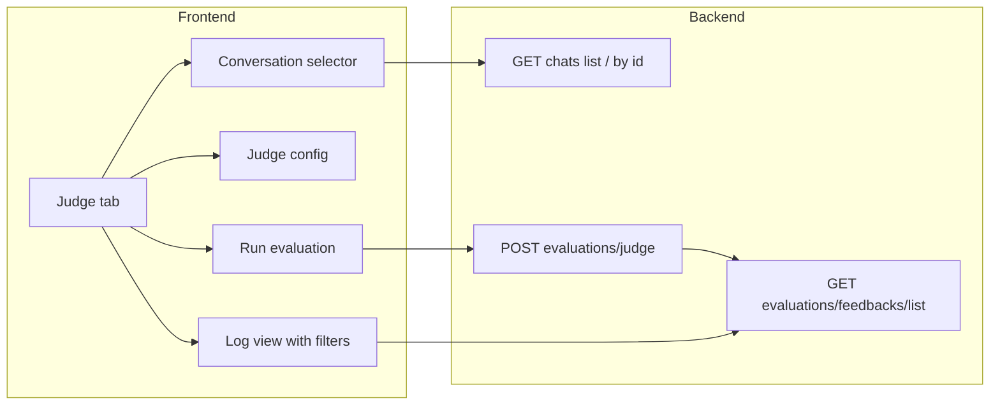

# LLM-as-Judge Evaluation Dashboard (Opik-style)

**Status:** Implemented as prototype (backend + frontend). Judge uses OpenAI-compatible API (e.g. OpenRouter); **LiteLLM is not required**.

## Implementation status (as built)

| Plan item | Status | Notes |
|-----------|--------|--------|
| Admin load any chat (GET /chats/{id}) | Done | `chats.py`: if not found by user, admin can load by `get_chat_by_id(id)`. |
| POST /evaluations/judge | Done | Request: chat_id, message_ids, judge_model_id?, judge_system_prompt?. Stores feedback with meta.source = "llm_judge". |
| GET /feedbacks/list filters | Done | Query params: chat_id, source, date_from, date_to, model_id, rating (backend + Feedbacks.get_feedback_items). |
| Evaluations.svelte third tab "Judge" | Done | Tab links to /admin/evaluations/judge; renders JudgeDashboard. |
| JudgeDashboard.svelte | Done | Conversation selector (chat dropdown + assistant message checkboxes), judge config (model + system prompt), Run LLM judge button, log table with Source + Rating filters and FeedbackModal on row click. |
| runJudge + getFeedbackItems (filters) | Done | `src/lib/apis/evaluations/index.ts`: runJudge, getFeedbackItems(..., filters). |
| **Chat scope (admin)** | Done | Judge dashboard: "Show chats" = My chats / By user / All. GET /chats/for-evaluation?user_id= (optional). Admin can list all chats or filter by user; users see own chats only. |
| **Reject responses tab** | Done | New tab "Reject" under Admin > Evaluations. Shows assistant messages that match policy-refusal keywords (e.g. 申し訳ありません, I can only answer). Content-based filter — no DB flag. GET /evaluations/reject-responses (admin). Optional filters: user_id, keywords (comma-separated). |
| **Gaps (optional / future)** | | Log view: backend supports chat_id, date_from, date_to, model_id but UI only exposes source + rating filters. Progress: shows "Calling judge..." not per-message "Evaluating 1/5…". |

## Goal

Under **Admin > Evaluations**, add a third area that provides:

1. **Conversation selector** – Choose a chat, then select which assistant messages to evaluate.
2. **LLM-as-judge** – Configure and run a judge model to score those messages (e.g. 1 / -1 + reason).
3. **Log-style view** – Table of evaluation results (score, reason, chat, model, date) with filters (chat, date range, model, score, source manual vs LLM judge).

Existing pieces: [Evaluations.svelte](src/lib/components/admin/Evaluations.svelte) (tabs: Leaderboard, Feedbacks), [evaluations router](backend/open_webui/routers/evaluations.py) (POST /feedback, GET /feedbacks/list), [feedback model](backend/open_webui/models/feedbacks.py) (meta.chat_id, meta.message_id, data.rating, data.reason). No DB schema change needed; store judge results as feedback with `meta.source = "llm_judge"`.

---

## Architecture (high level)

---

## 1. Backend

### 1.1 Admin chat access for loading any chat

- Today: GET /chats/{id} uses `get_chat_by_id_and_user_id` only, so admins cannot load another user's chat by id.
- **Change:** In the same handler (or a dedicated admin path), when `user.role == "admin"`, allow loading by chat id: e.g. `chat = Chats.get_chat_by_id(id, db=db)` if not found as owner. So the Judge UI can load any chat when the user is admin.

### 1.2 New endpoint: run LLM judge

- **Route:** `POST /api/v1/evaluations/judge` (or under existing evaluations router).
- **Auth:** Verified user (or admin-only; recommend verified user so users can judge their own chats).
- **Request body (example):**
  - `chat_id: str`
  - `message_ids: list[str]` (assistant message ids in `chat.chat.history.messages`)
  - `judge_model_id?: str` (optional; default from config or first available model)
  - `judge_system_prompt?: str` (optional; default prompt that asks for JSON `{"rating": 1|-1, "reason": "..."}`)
- **Logic:**
  - Load chat: user's own via `get_chat_by_id_and_user_id`, or if admin, allow `get_chat_by_id`.
  - For each `message_id`, get the message and its parent (user message) from `chat.chat.history.messages`.
  - Build judge prompt (e.g. "User: {user_content}\nAssistant: {assistant_content}\nModel: {model_id}. Rate 1 or -1 and reason.").
  - Call OpenAI-compatible completion using `judge_model_id` (reuse existing inference path used by chat completions).
  - Parse JSON from response; extract `rating` and `reason`.
  - Create feedback row: `Feedbacks.insert_new_feedback(user_id=..., form_data=FeedbackForm(type="rating", data=RatingData(...), meta={"chat_id", "message_id", "source": "llm_judge"}, snapshot={"chat": ...}), db=db)`.
  - Return summary: e.g. `{ "evaluated": n, "feedback_ids": [...] }`.
- **Error handling:** Per-message failures (e.g. parse error) should not abort the whole batch; record failure and continue, and include failures in the response.

### 1.3 Feedback list filters (for log view)

- **Current:** GET /evaluations/feedbacks/list supports `order_by`, `direction`, `page`; get_feedback_items filters only by order.
- **Change:** Add optional query params: `chat_id`, `source` (e.g. `llm_judge` or `manual`), `date_from`, `date_to`, `model_id`, `rating`. In Feedbacks.get_feedback_items, add filters on meta.chat_id, meta.source, created_at range, data.model_id, data.rating (JSON filters; handle SQLite vs PostgreSQL).
- **Response:** Reuse existing list response; no new DTO.

---

## 2. Frontend

### 2.1 New tab: "Judge" (or "Evaluation dashboard")

- **File:** Evaluations.svelte.
- **Change:** Add a third tab next to Leaderboard and Feedback, linking to `/admin/evaluations/judge`.
- **Route:** Reuse existing (app)/admin/evaluations/[tab]/+page.svelte with tab = "judge"; ensure selectedTab includes "judge" and render the new component.

### 2.2 New component: Judge dashboard

- **New file:** e.g. `src/lib/components/admin/Evaluations/JudgeDashboard.svelte`.

**Sections:**

1. **Conversation selector**
   - Chat list: Admin uses endpoint that returns all chats (e.g. GET /chats/all/db); non-admin uses getChatList. Show title, id, updated_at; user selects one chat.
   - Load chat: GET /chats/{id} (admin must be able to load any chat per backend change).
   - Message list: From chat.chat.history.messages, list assistant messages. Show preview, message id, model. Checkboxes to select messages to evaluate (or "Select all").
   - Pagination if needed.

2. **Judge config**
   - Judge model: Dropdown of available models (reuse models store). Default to a sensible small model if configured.
   - System prompt (optional): Text area with default prompt for JSON output `{"rating": 1|-1, "reason": "..."}`. User can override.

3. **Run evaluation**
   - Button "Run LLM judge". Call POST /evaluations/judge with chat_id, message_ids, judge_model_id, judge_system_prompt.
   - Show progress ("Evaluating 1/5…"); toast on success/failure; refresh log view on success.

4. **Log view (scores + filters)**
   - Table: User, Model, Rating, Reason, Updated at, Chat link, Source (manual / LLM judge). Optional message preview.
   - Filters: Chat, Date range, Model, Score (All/1/-1), Source (All/Manual/LLM judge).
   - Data: GET /evaluations/feedbacks/list with new query params and pagination/sort.
   - Detail modal: Reuse FeedbackModal for row click; ensure it works for meta.source === "llm_judge".

### 2.3 API client

- **File:** src/lib/apis/evaluations/index.ts.
- **Add:** `runJudge(token, body)` for POST .../evaluations/judge.
- **Extend:** getFeedbackItems to accept optional chat_id, source, date_from, date_to, model_id, rating as query params.

---

## 3. Config / defaults (optional)

- Judge default model: Config or env for default judge model id.
- Default judge prompt: Hardcode in backend/frontend (e.g. "You are a judge. Given the user message and the assistant reply, output only a JSON object with keys: rating (1 or -1), reason (short string).").

---

## 4. Testing and edge cases

- Empty chat / no assistant messages: Show "No assistant messages to evaluate"; disable Run.
- Judge model failure or non-JSON: Backend catch, optional retry, record failure per message, return partial success + failed message_ids.
- Admin vs user: Admin sees all chats and can load any; user sees own chats and own feedbacks. Feedbacks use requesting user as user_id and meta.source = "llm_judge".

---

## 5. File and endpoint summary

| Area | Action |
|------|--------|
| backend/open_webui/routers/chats.py | Allow admin to load any chat by id in GET /chats/{id}. |
| backend/open_webui/routers/evaluations.py | Add POST /evaluations/judge; extend GET /evaluations/feedbacks/list with optional chat_id, source, date_from, date_to, model_id, rating. |
| backend/open_webui/models/feedbacks.py | Extend get_feedback_items to filter by meta.chat_id, meta.source, created_at, data.model_id, data.rating (SQLite/PostgreSQL). |
| src/lib/components/admin/Evaluations.svelte | Add third tab "Judge", link to /admin/evaluations/judge, render JudgeDashboard. |
| src/lib/components/admin/Evaluations/JudgeDashboard.svelte | New: conversation selector, judge config, run button, log table with filters. |
| src/lib/apis/evaluations/index.ts | Add runJudge; extend getFeedbackItems with filter params. |
| Route | Ensure /admin/evaluations/judge is valid ([tab] = "judge"). |

No new database tables or migrations; reuse `feedback` table and existing evaluation APIs.

---

## Keeping the plan in sync

- The **Implementation status** table at the top reflects the current prototype. When you change backend or frontend (e.g. add log filters for chat/date/model, or per-message progress), update that table and the **Gaps** row so the plan stays accurate.
